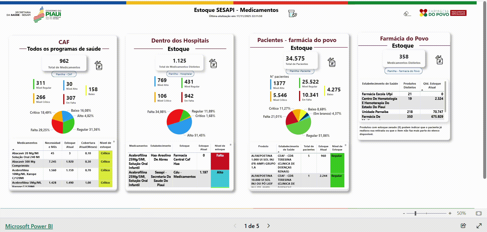

# 💊 Gestão de Estoque e Farmácia do Povo (SESAPI)

## 🎥 Demonstração do Painel

## 📋 Sobre o Projeto
Este dashboard foi desenvolvido para monitorar o ciclo completo de suprimentos da rede de saúde do Piauí. Ele integra dados do **CAF (Centro de Distribuição)**, estoque interno dos **Hospitais** e o atendimento direto aos pacientes através da **Farmácia do Povo**.

A ferramenta permite uma visão 360º da disponibilidade de medicamentos, identificando criticidade de estoque (falta ou baixo nível) para garantir que o tratamento dos pacientes não seja interrompido por falhas logísticas.

## 💡 Estrutura do Painel
O monitoramento é dividido em quatro pilares principais:
1.  **CAF:** Visão geral de todos os programas de saúde e cobertura de estoque em meses.
2.  **Hospitais:** Detalhamento do estoque físico dentro das unidades hospitalares.
3.  **Pacientes (Farmácia do Povo):** Controle de dispensação e níveis de atendimento por perfil crítico.
4.  **Localização:** Status de estoque por unidade e estabelecimento de saúde.

## 🛠️ Tecnologias Utilizadas
* **Power BI:** Visualização e análise.
* **DAX Avançado:** Cálculo de cobertura de estoque, curva ABC e alertas de ruptura.
* **Tratamento de Dados:** Limpeza de bases complexas provenientes de sistemas hospitalares.

## 📈 Principais Indicadores (KPIs)
* **Nível de Estoque:** Classificação automática em Crítico, Baixo, Regular ou Alto.
* **Cobertura Mensal:** Estimativa de quanto tempo o estoque atual suportará a demanda.
* **Itens em Falta:** Lista prioritária para processos de compra e remanejamento.

---
*Transformando logística em assistência farmacêutica eficiente.*
